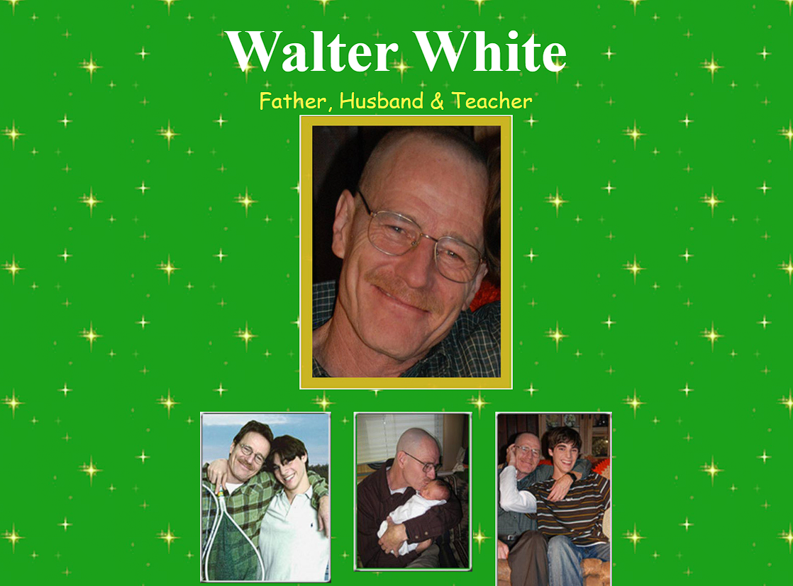

# SAVE WALTER WHITE - Clone

**This repository is a clone — created solely for learning and personal development purposes.**

## Description
This project is a clone of the [savewalterwhite.com](http://www.savewalterwhite.com/) website, inspired by its visuals and design, **recreated purely for personal learning and development purposes**.  
The goal is to practice HTML/CSS and improve front-end skills.  

> Note: This project is not commercial and has no official affiliation with the original site.

## Screenshot

## What Was Done
* A static clone was created while staying faithful to the original site's visual design.
* Images were taken from the original site for UX testing and design practice.
* **Updated layout using modern CSS (`display: flex`) for better structure and maintainability.**
* Original site was using older CSS, this version refactors it with a new CSS approach.

## How to Run
1. Clone the repository: `git clone <repo-url>`  
2. Open the `index.html` file in a browser or run it via a simple HTTP server.

## Contact / Developer
This project was developed by **[burakdmr25](https://github.com/burakdmr25)**.  
For any requests, suggestions, or corrections, you can reach out via GitHub.

---

**Note:** This project is entirely for personal learning and development purposes. All content belongs to AMC and the Breaking Bad universe. Copyrights and legal responsibilities remain with the original content owner; I am not responsible for any issues related to this project.  

**Original source:** [http://www.savewalterwhite.com/](http://www.savewalterwhite.com/)

---

# SAVE WALTER WHITE - Klon (Türkçe)

**Bu depo bir klondur — yalnızca öğrenme ve kişisel gelişim amaçlıdır.**

## Açıklama
Bu proje, [savewalterwhite.com](http://www.savewalterwhite.com/) sitesinin görsel ve tasarımından ilham alınarak **kişisel öğrenme ve geliştirme amaçlı** olarak yeniden oluşturulmuş bir klondur.  
Amacım HTML/CSS pratikleri yapmak ve front-end becerilerimi geliştirmektir.  

> Not: Proje ticari değildir ve orijinal siteyle hiçbir resmi ilişkisi yoktur.

## Ekran Görüntüsü

## Neler Yapıldı
* Orijinal sitenin görsel tasarımına sadık kalınarak statik bir klon oluşturuldu.
* Görseller, kullanıcı deneyimi testi ve tasarım çalışmaları için orijinal siteden alınmıştır.
* **Eski CSS yerine modern `display: flex` ile yeniden tasarlanmıştır.**

## Çalıştırma
1. Depoyu klonlayın: `git clone <repo-url>`  
2. `index.html` dosyasını bir tarayıcıda açın veya basit bir HTTP sunucusu ile çalıştırın.

## İletişim / Geliştirici
Bu proje **[burakdmr25](https://github.com/burakdmr25)** tarafından geliştirilmiştir.  
Herhangi bir talep, öneri veya düzeltme için GitHub üzerinden iletişime geçebilirsiniz.

---

**Not:** Bu proje tamamen öğrenme ve kişisel gelişim amaçlıdır. Tüm içerik AMC ve Breaking Bad evrenine aittir. Telif hakları orijinal içerik sahibine aittir.  
**Orijinal kaynak:** [http://www.savewalterwhite.com/](http://www.savewalterwhite.com/)
